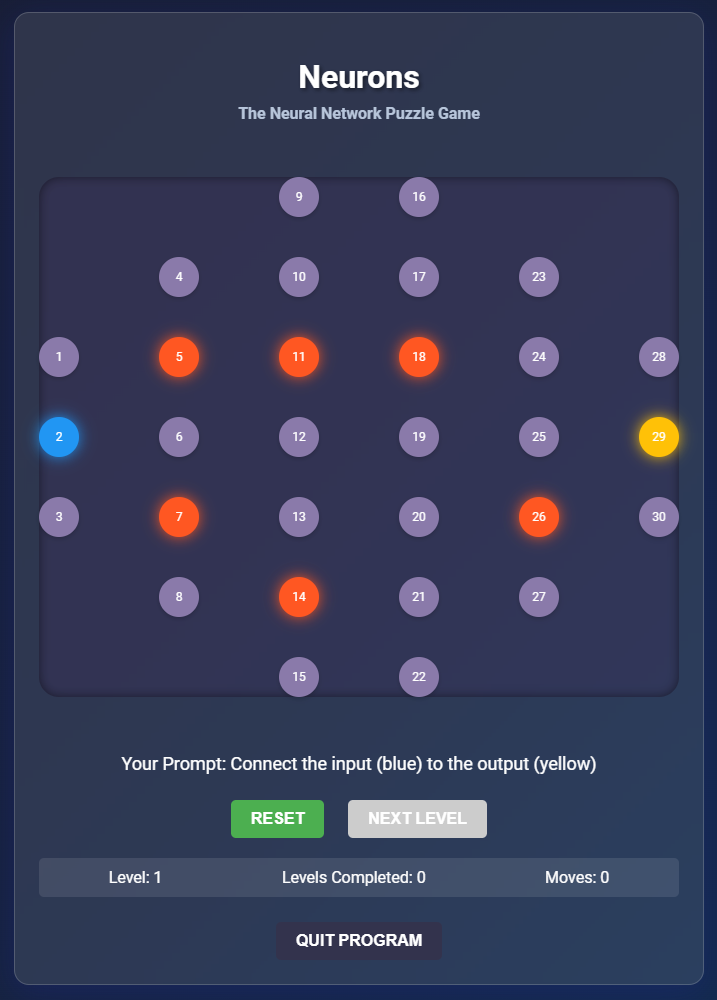

# Neurons: The Neural Network Puzzle Game

## Overview
Neurons is a puzzle game that challenges players to connect input neurons to output neurons by creating a path through a neural network. The game is designed to simulate the behavior of neurons and synapses in a fun and interactive way.
## Gameplay
The game consists of going through levels, each with a unique neural network layout.
Players must connect the input neuron (blue) to the output neuron (yellow) by clicking on neurons to activate them.
Activated neurons can be connected to each other to create a path.
Obstacles (orange) must be avoided, as they cannot be used to create a path.
The game keeps track of the number of moves made and the number of levels completed.
## Features
Advancing levels with adjustable difficulty
Unique neural network layout for each level
Input, output, and obstacle neurons
Move counter and level completion tracker
Interactive gameplay with animations and sound effects
## Technical Details
Built using HTML, CSS, and JavaScript
Uses SVG for drawing connections between neurons
Implements a queue-based algorithm for checking win conditions
## Contributing
Contributions are welcome! If you'd like to add new features or levels to the game, please submit a pull request.
## License
This game is licensed under the MIT License.

# Additional Information

In the game Neurons, the levels can get progressively more difficult through several mechanisms:

- Increased network size: As the player advances through levels, the neural network grows in size, with more neurons and layers. This requires the player to make more connections and navigate a larger network.
- More obstacles: The number of obstacle neurons (red) increases, making it harder for the player to find a path between the input and output neurons.
- Complex network topology: Later levels feature more complex network structures, with neurons arranged in a way that requires more strategic thinking to connect the input to the output.
- Reduced accessible neurons: Some neurons may be placed in a way that makes them harder to reach or require more moves to activate, adding to the challenge.
- Increased distance between input and output: The input and output neurons are placed farther apart, requiring the player to make more connections to reach the output.

Here's a breakdown of the code that controls each mechanism:

**1. Increased network size**

In the createBoard function, the LAYERS array defines the number of neurons in each layer. To increase the network size, more layers or neurons per layer can be added:

<code>const LAYERS = [3, 5, 7, 7, 5, 3]; // Initial network size
...
// To increase network size, add more layers or neurons per layer
const LAYERS = [3, 5, 7, 9, 11, 13, 15]; // Increased network size</code>

**2. More obstacles**

In the createBoard function, the obstacleCount variable determines the number of obstacle neurons. To add more obstacles, increase this value:

<code>const obstacleCount = Math.floor(neurons.length / 5); // Initial obstacle count
...
// To add more obstacles, increase the obstacle count
const obstacleCount = Math.floor(neurons.length / 3);</code>

3. Complex network topology
4. 
The getNeighbors function determines which neurons are connected. To create a more complex topology, modify this function to include more or different neighboring neurons:

<code>function getNeighbors(index) {
  const neighbors = [];
  ...
  // Add more neighboring neurons to create a more complex topology
  if (currentLayer > 0) {
    for (let i = prevLayerStart; i < currentLayerStart; i++) {
      neighbors.push(i);
    }
  }
  if (currentLayer < LAYERS.length - 1) {
    for (let i = nextLayerStart; i < nextLayerStart + LAYERS[currentLayer + 1]; i++) {
      neighbors.push(i);
    }
  }
  // Add diagonal or other connections to increase complexity
  if (index % 2 === 0) {
    neighbors.push(index + 1);
  } else {
    neighbors.push(index - 1);
  }
}</code>

**4. Reduced accessible neurons**

In the createBoard function, the neuron elements are created and appended to the game board. To reduce accessible neurons, add a condition to skip creating certain neurons:

<code>for (let i = 0; i < LAYERS.length; i++) {
  const layerSize = LAYERS[i];
  ...
  for (let j = 0; j < layerSize; j++) {
    // Skip creating every other neuron, for example
    if (j % 2 === 0) {
      continue;
    }
    const neuron = document.createElement('div');
    ...
  }
}</code>

**5. Increased distance between input and output**

In the createBoard function, the inputNeuron and outputNeuron indices are randomly selected. To increase the distance, modify the random selection to favor more distant neurons:

<code>inputNeuron = Math.floor(Math.random() * LAYERS[0]);
outputNeuron = neurons.length - 1 - Math.floor(Math.random() * LAYERS[LAYERS.length - 1]);
...
// To increase distance, select input and output from different halves of the network
if (Math.random() < 0.5) {
  inputNeuron = Math.floor(Math.random() * neurons.length / 2);
} else {
  inputNeuron = Math.floor(Math.random() * neurons.length / 2) + neurons.length / 2;
}
outputNeuron = neurons.length - 1 - inputNeuron;</code>

These code modifications can be adjusted to create increasingly challenging levels.
